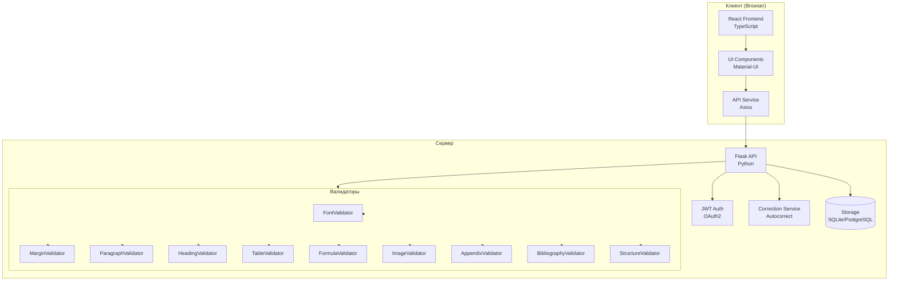
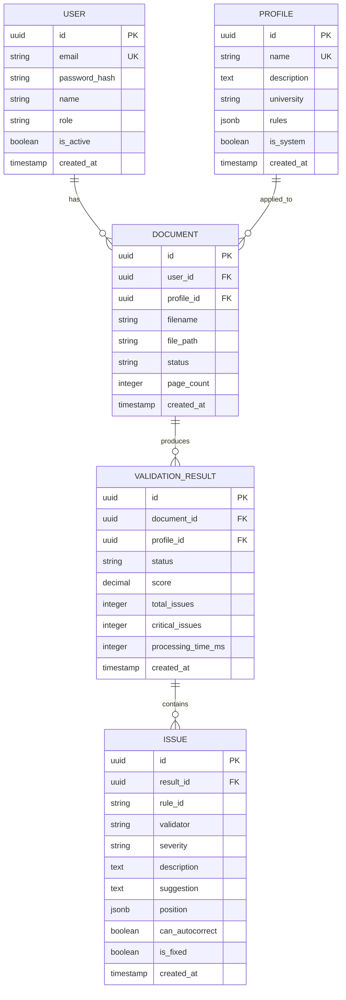
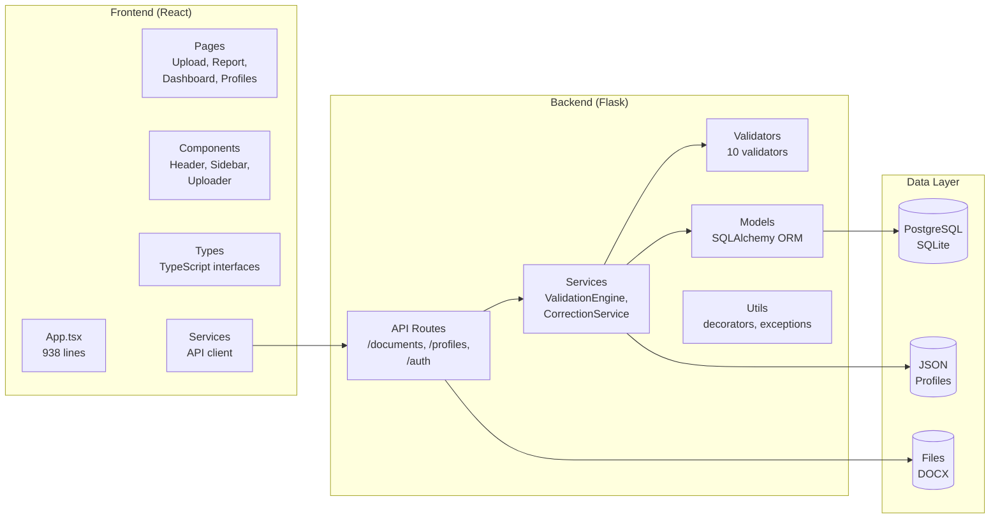
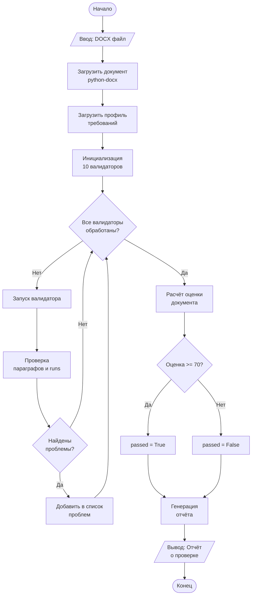
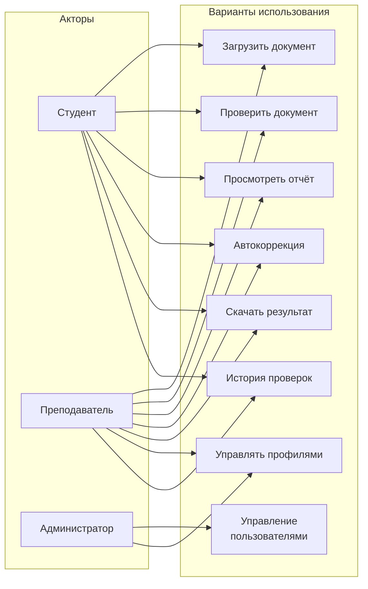
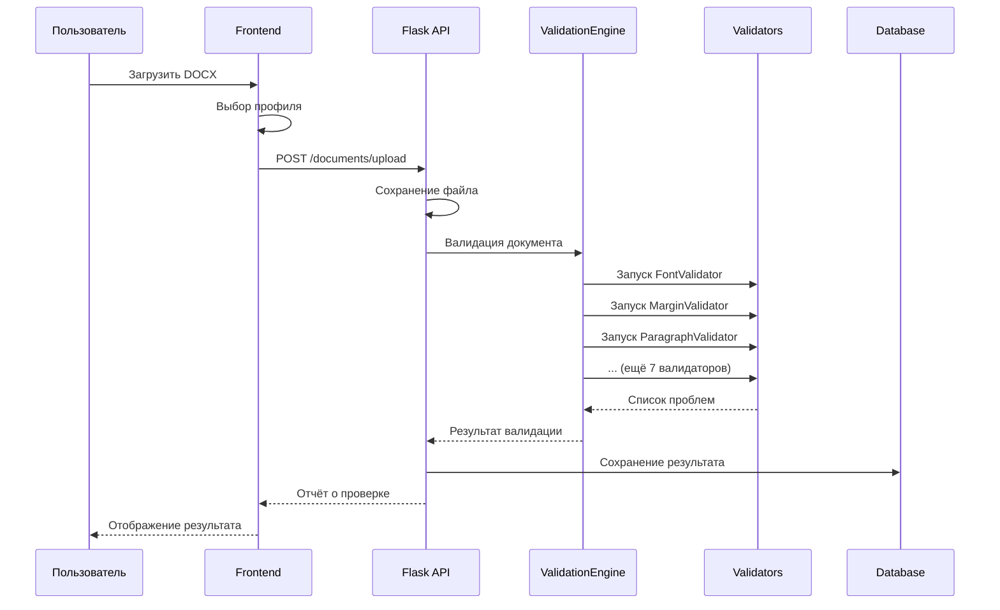
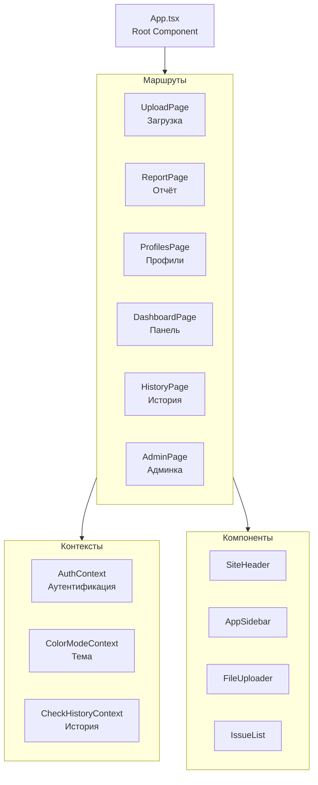

# ДИАГРАММЫ АРХИТЕКТУРЫ И МОДЕЛЕЙ

> Для отображения диаграмм используйте расширение Mermaid Previewer или скопируйте код в https://mermaid.live

---

## Диаграмма 1: Общая архитектура системы



---

## Диаграмма 2: ER-диаграмма базы данных



---

## Диаграмма 3: Диаграмма компонентов



---

## Диаграмма 4: Алгоритм валидации документа



---

## Диаграмма 5: Диаграмма вариантов использования



---

## Диаграмма 6: Диаграмма последовательности (загрузка и проверка)



---

## Диаграмма 7: Структура Frontend



---

## Диаграмма 8: Структура Backend

```mermaid
graph TD
    Flask[Flask App<br/>create_app()] --> Blueprints

    subgraph Blueprints["Blueprints"]
        AuthBP[auth_routes<br/>Аутентификация]
        DocBP[document_routes<br/>Документы]
        ProfileBP[profile_routes<br/>Профили]
    end

    subgraph Services["Services"]
        ValidationEngine[validation_engine.py<br/>Оркестратор]
        CorrectionService[correction_service.py<br/>Автокоррекция]
        DocumentProcessor[document_processor.py<br/>Обработка]
    end

    subgraph Validators["Validators"]
        Base[base.py<br/>BaseValidator]
        Font[font_validator.py]
        Margin[margin_validator.py]
        Paragraph[paragraph_validator.py]
        Heading[heading_validator.py]
        Table[table_validator.py]
        Formula[formula_validator.py]
        Image[image_validator.py]
        Appendix[appendix_validator.py]
        Bibliography[bibliography_validator.py]
        Structure[structure_validator.py]
    end

    Blueprints --> Services
    Services --> Validators
    ValidationEngine --> Base
```

---

*Для просмотра диаграмм используйте онлайн-редактор: https://mermaid.live*
