# CURSA — Полный набор схем и диаграмм

> Автоматически сгенерировано на основе кодовой базы проекта.  
> Все диаграммы написаны в формате **Mermaid** — рендерятся в GitHub, GitLab, Obsidian, VS Code (плагин Mermaid Preview), Notion и др.

---

## Содержание

1. [ER-диаграмма базы данных](#1-er-диаграмма-базы-данных)
2. [Архитектура системы (высокий уровень)](#2-архитектура-системы-высокий-уровень)
3. [Схема развёртывания (Deployment)](#3-схема-развёртывания-deployment)
4. [Поток аутентификации — Email/Password + JWT](#4-поток-аутентификации--emailpassword--jwt)
5. [Поток аутентификации — OAuth2](#5-поток-аутентификации--oauth2)
6. [Поток аутентификации — 2FA (TOTP)](#6-поток-аутентификации--2fa-totp)
7. [Поток обработки документа (Upload → Check → Correct → Report)](#7-поток-обработки-документа-upload--check--correct--report)
8. [Конвейер валидаторов](#8-конвейер-валидаторов)
9. [Многопроходная автоисправление документа](#9-многопроходное-автоисправление-документа)
10. [API — маршруты и сервисы](#10-api--маршруты-и-сервисы)
11. [Диаграмма компонентов фронтенда](#11-диаграмма-компонентов-фронтенда)
12. [Состояния документа (State Machine)](#12-состояния-документа-state-machine)
13. [Жизненный цикл подписки (State Machine)](#13-жизненный-цикл-подписки-state-machine)
14. [Поток оплаты — Stripe](#14-поток-оплаты--stripe)
15. [Поток оплаты — YooKassa](#15-поток-оплаты--yookassa)
16. [Управление API-ключами](#16-управление-api-ключами)
17. [Модель ролей и доступа (RBAC)](#17-модель-ролей-и-доступа-rbac)
18. [Диаграмма классов — Модели](#18-диаграмма-классов--модели)
19. [Диаграмма классов — Сервисы](#19-диаграмма-классов--сервисы)
20. [Диаграмма классов — Валидаторы](#20-диаграмма-классов--валидаторы)
21. [Диаграмма классов — Корректоры](#21-диаграмма-классов--корректоры)
22. [Sequence: Вход пользователя](#22-sequence-вход-пользователя)
23. [Sequence: Загрузка и проверка документа](#23-sequence-загрузка-и-проверка-документа)
24. [Sequence: Автоисправление документа](#24-sequence-автоисправление-документа)
25. [Sequence: Refresh JWT-токена](#25-sequence-refresh-jwt-токена)
26. [Структура профилей валидации](#26-структура-профилей-валидации)
27. [Дерево маршрутов фронтенда](#27-дерево-маршрутов-фронтенда)
28. [Обзорная диаграмма безопасности](#28-обзорная-диаграмма-безопасности)

---

## 1. ER-диаграмма базы данных

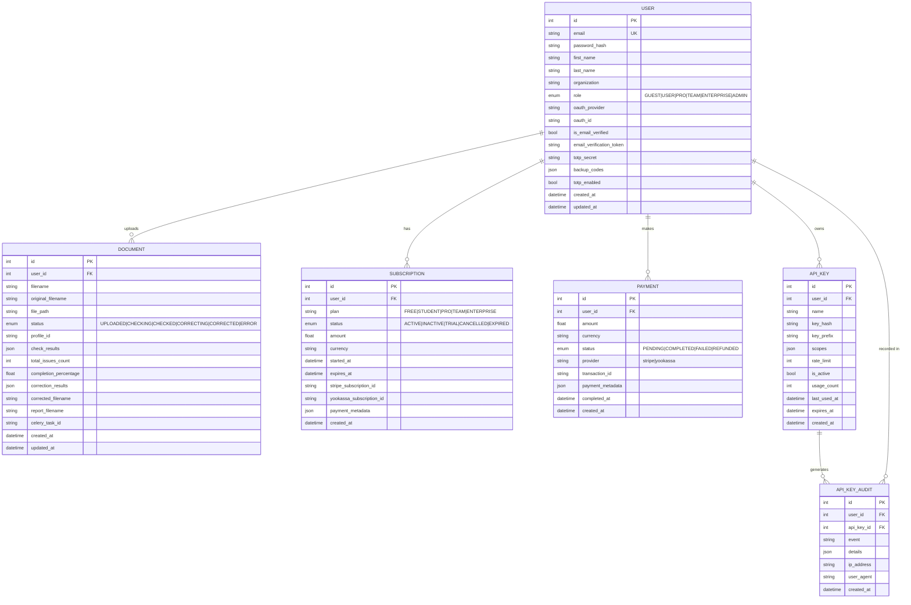

---

## 2. Архитектура системы (высокий уровень)

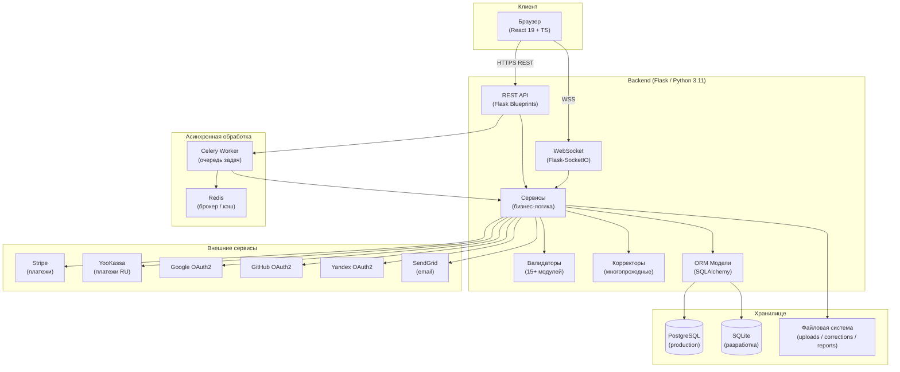

---

## 3. Схема развёртывания (Deployment)

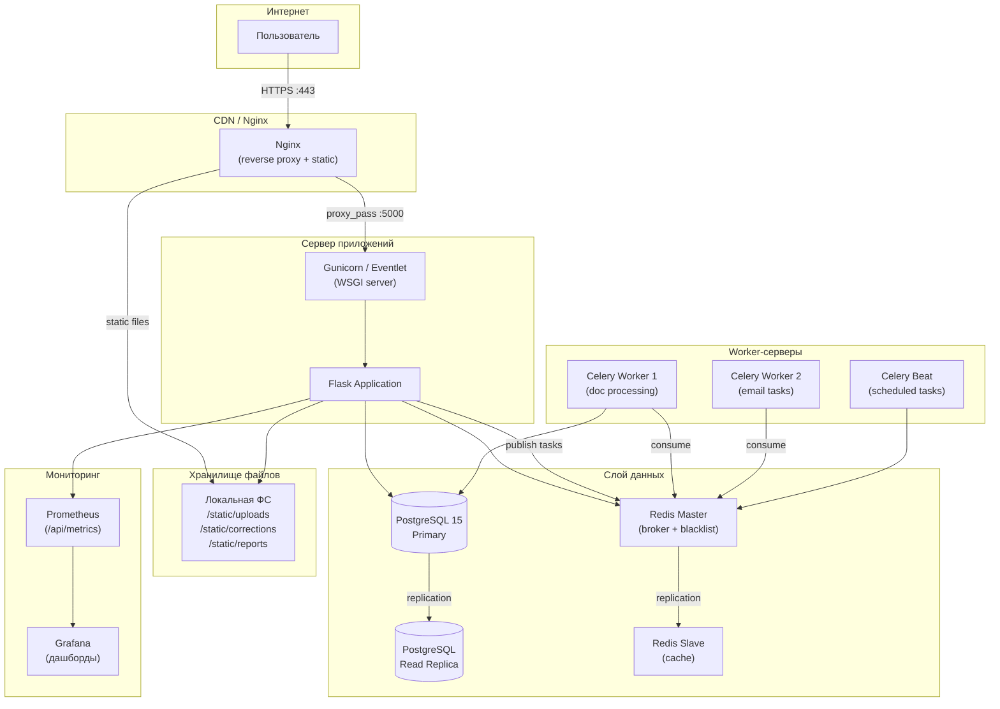

---

## 4. Поток аутентификации — Email/Password + JWT

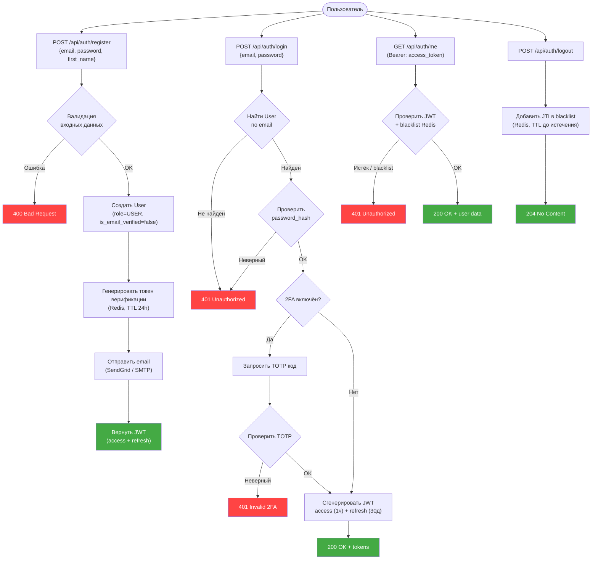

---

## 5. Поток аутентификации — OAuth2

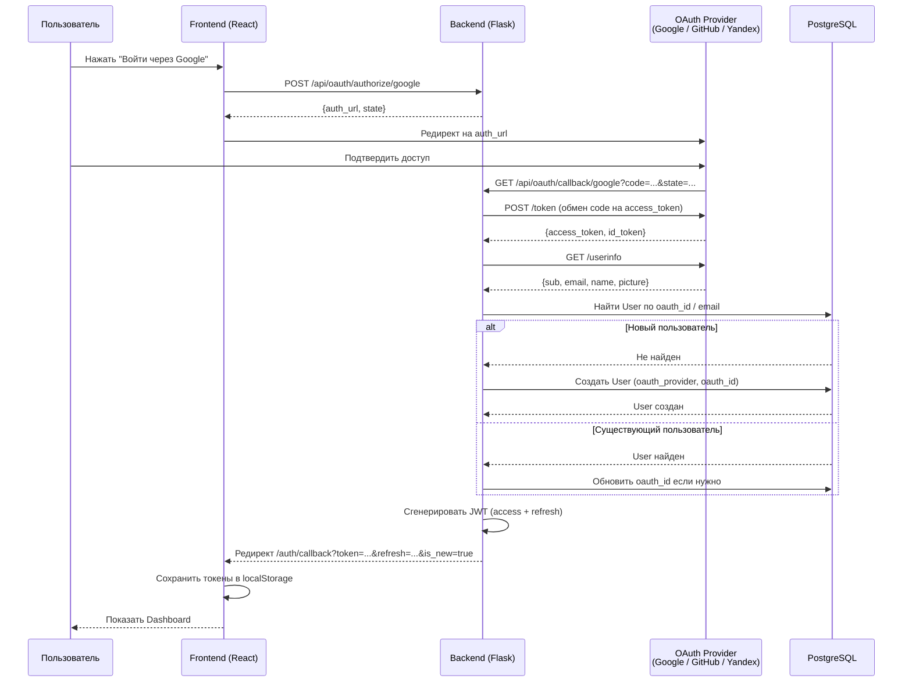

---

## 6. Поток аутентификации — 2FA (TOTP)

```mermaid
flowchart TD
    subgraph SETUP["Настройка 2FA"]
        A1["GET /api/auth/2fa/setup"] --> B1["Генерировать TOTP secret\n(pyotp.random_base32)"]
        B1 --> C1["Сохранить secret во\nUser.totp_secret (temp)"]
        C1 --> D1["Вернуть QR-код URL\n+ secret для ручного ввода"]
        D1 --> E1["Пользователь сканирует QR\n(Google Authenticator / Authy)"]
        E1 --> F1["POST /api/auth/2fa/enable\n{totp_code}"]
        F1 --> G1{Проверить TOTP}
        G1 -->|Неверный| H1["400 Invalid Code"]
        G1 -->|OK| I1["User.totp_enabled = True"]
        I1 --> J1["Генерировать 10 backup codes\n(sha256-хэшированные)"]
        J1 --> K1["Вернуть backup codes\n(показать единожды!)"]
    end

    subgraph LOGIN["Вход с 2FA"]
        A2["POST /api/auth/login"] --> B2{Пароль верен?}
        B2 -->|Нет| C2["401"]
        B2 -->|Да| D2{totp_enabled?}
        D2 -->|Нет| E2["Вернуть JWT"]
        D2 -->|Да| F2["Запросить TOTP/backup code"]
        F2 --> G2["POST /api/auth/2fa/verify\n{code}"]
        G2 --> H2{Тип кода}
        H2 -->|TOTP| I2{pyotp.verify?}
        H2 -->|Backup| J2{Код в backup_codes?}
        I2 -->|OK| K2["Вернуть JWT"]
        I2 -->|Нет| L2["401 Invalid 2FA"]
        J2 -->|OK| M2["Удалить использованный код"]
        M2 --> K2
        J2 -->|Нет| L2
    end

    subgraph DISABLE["Отключение 2FA"]
        A3["POST /api/auth/2fa/disable\n{password}"] --> B3{Пароль верен?}
        B3 -->|Нет| C3["401"]
        B3 -->|Да| D3["User.totp_enabled = False\nUser.totp_secret = None\nUser.backup_codes = []"]
        D3 --> E3["200 OK"]
    end

    style H1 fill:#f44,color:#fff
    style C2 fill:#f44,color:#fff
    style L2 fill:#f44,color:#fff
    style C3 fill:#f44,color:#fff
```

---

## 7. Поток обработки документа (Upload → Check → Correct → Report)

```mermaid
flowchart TD
    START([Пользователь загружает DOCX]) --> A

    A["POST /api/document/upload\n{file, profile_id}"] --> B{Валидация файла}
    B -->|Не DOCX / > 50MB| ERR1["400 Invalid File"]
    B -->|OK| C["Создать Document\nstatus=UPLOADED"]
    C --> D{Async mode?}
    D -->|Celery| E["Поставить задачу\nв очередь Redis"]
    D -->|Sync| F

    E --> F["DocumentProcessor\n.extract_data(docx)"]
    F --> F1["Загрузить python-docx"]
    F1 --> F2["Извлечь параграфы\nшрифты, отступы"]
    F2 --> F3["Извлечь таблицы\nизображения, стили"]
    F3 --> F4["Извлечь поля\nколонтитулы, сноски"]
    F4 --> F5{{"Структурированные данные документа"}}

    F5 --> G["ValidationEngine\n.validate_document(data, profile)"]
    G --> G1["Загрузить профиль ГОСТ\n(JSON)"]
    G1 --> G2["Запустить 15+ валидаторов\nпоследовательно"]
    G2 --> G3{{"Список нарушений\n[severity, location, message]"}}
    G3 --> G4["Подсчитать статистику\n(score, completion_%)"]
    G4 --> H["Обновить Document\ncheck_results=JSON\nstatus=CHECKED"]
    H --> I{{"Результаты проверки\nпользователю"}}

    I --> J{Пользователь хочет\nавтоисправление?}
    J -->|Нет| REPORT
    J -->|Да| K

    K["POST /api/document/correct\n{document_id}"] --> L["DocumentCorrector\n.correct_multipass(docx)"]
    L --> M["Проход 1: Шрифты\nTimes New Roman 14pt"]
    M --> N["Проход 2: Поля\n3/1/2/2 см"]
    N --> O["Проход 3: Интервалы\n1.5, отступ 1.25 см"]
    O --> P["Проход 4: Структура\nзаголовки, нумерация"]
    P --> Q["Ре-валидация после\nкаждого прохода"]
    Q --> R{Все проходы\nвыполнены?}
    R -->|Нет| M
    R -->|Да| S["Сохранить исправленный DOCX\napp/static/corrections/"]
    S --> T["Обновить Document\ncorrected_filename\nstatus=CORRECTED"]

    T --> REPORT
    I --> REPORT

    REPORT["POST /api/document/generate-report\n{document_id}"] --> REP1["Создать DOCX-отчёт\n(docxtpl)"]
    REP1 --> REP2["Включить: нарушения,\nисправления, рекомендации"]
    REP2 --> REP3["Сохранить в\napp/static/reports/"]
    REP3 --> END(["Ссылки для скачивания\nисправленного файла + отчёта"])

    style ERR1 fill:#f44,color:#fff
    style END fill:#4a4,color:#fff
```

---

## 8. Конвейер валидаторов

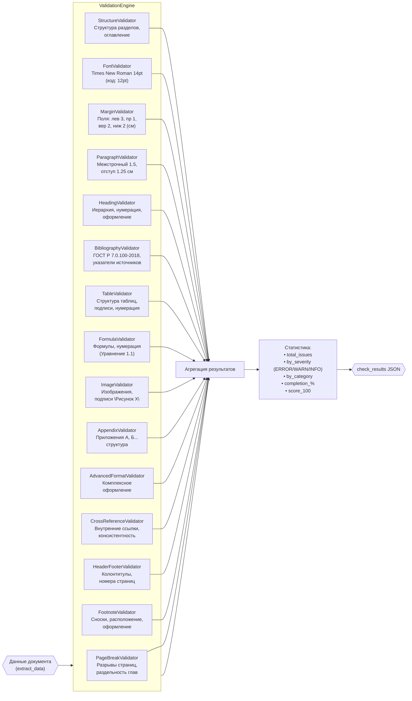

---

## 9. Многопроходное автоисправление документа

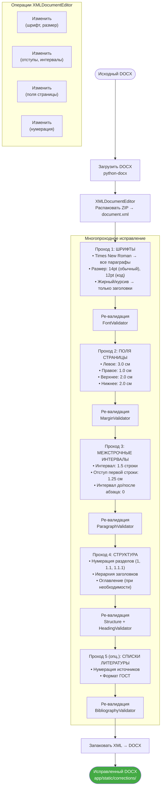

---

## 10. API — маршруты и сервисы

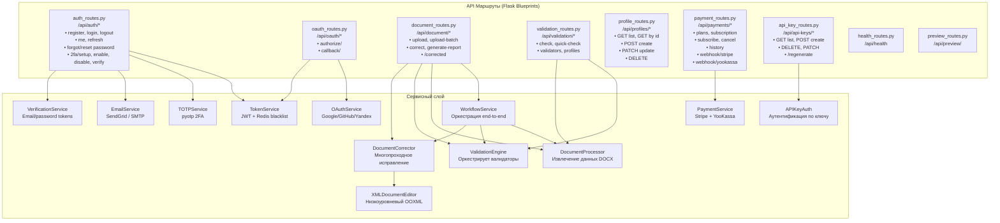

---

## 11. Диаграмма компонентов фронтенда

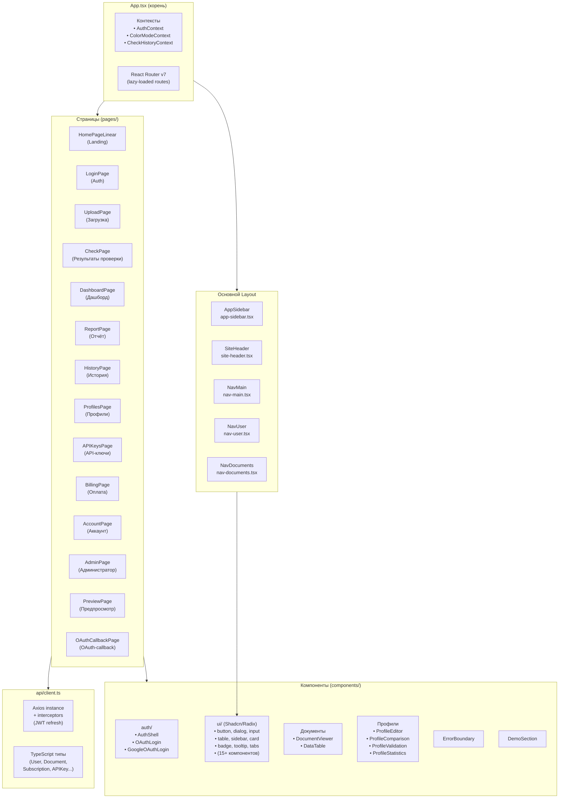

---

## 12. Состояния документа (State Machine)

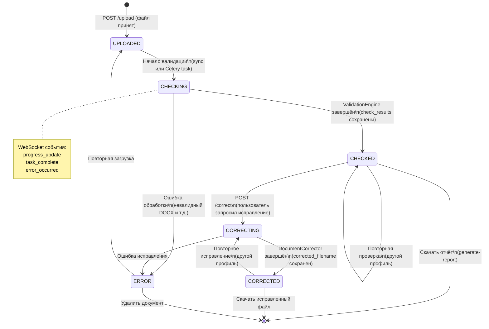

---

## 13. Жизненный цикл подписки (State Machine)

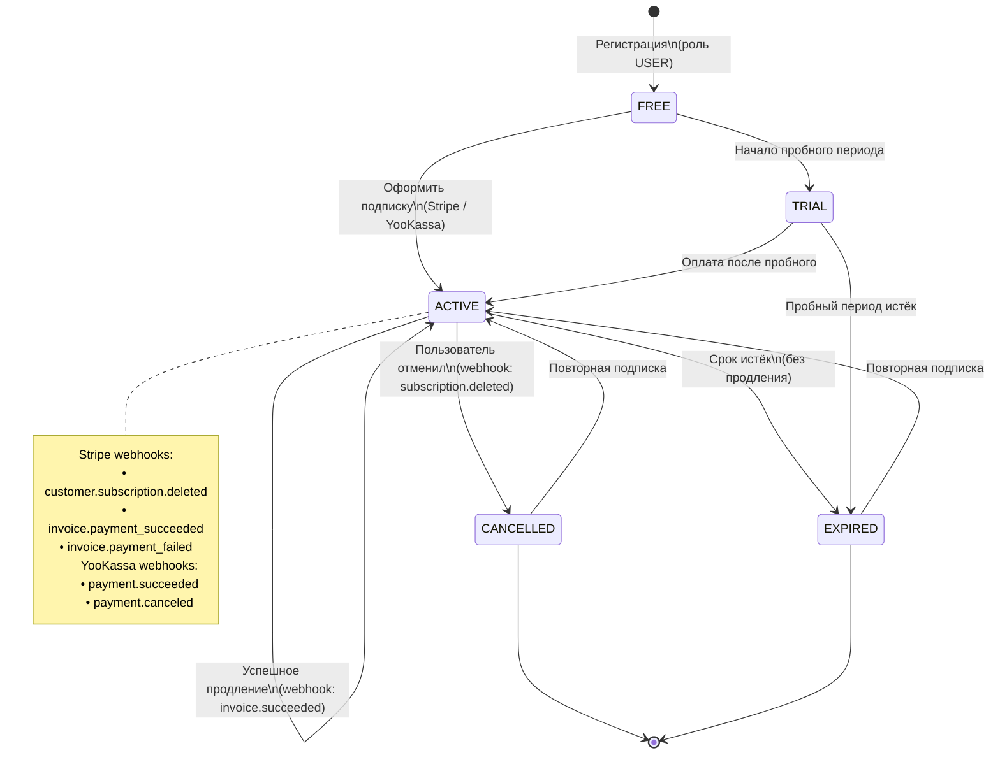

---

## 14. Поток оплаты — Stripe

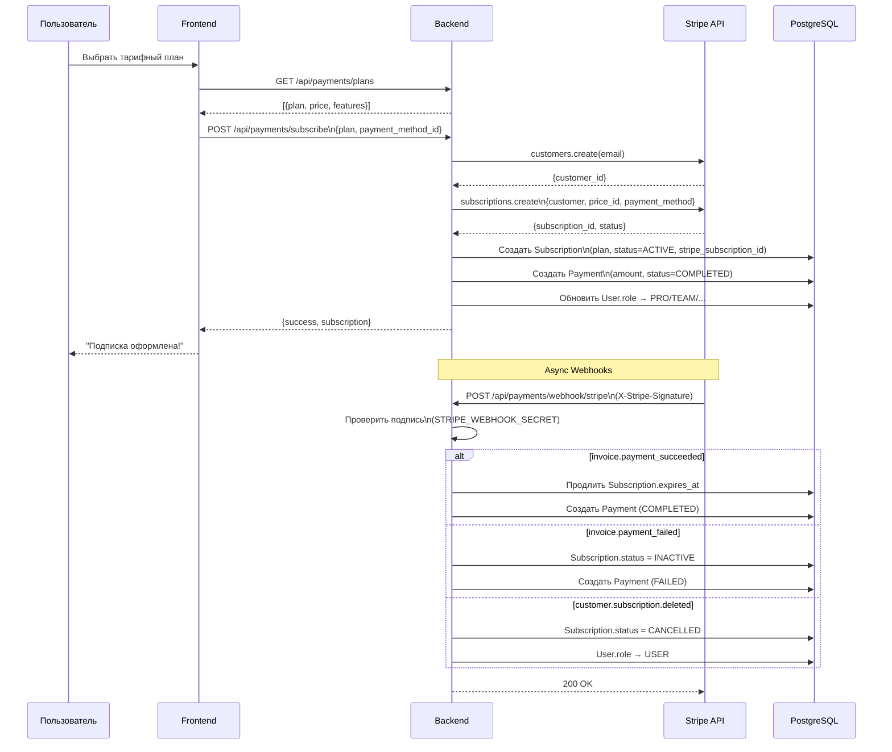

---

## 15. Поток оплаты — YooKassa

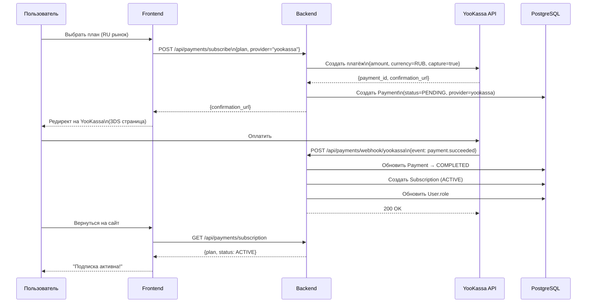

---

## 16. Управление API-ключами

```mermaid
flowchart TD
    subgraph CREATE["Создание ключа"]
        A1["POST /api/api-keys\n{name, scopes, rate_limit}"] --> B1["Генерировать ключ\nsk_<prefix>_<random64>"]
        B1 --> C1["sha256(key) → key_hash\nSохранить key_prefix"]
        C1 --> D1["Создать APIKey в DB\n(key_hash, scopes, rate_limit)"]
        D1 --> E1["Создать AuditLog\n(event=created)"]
        E1 --> F1["Вернуть ключ\n(единственный раз!)"]
    end

    subgraph AUTH["Аутентификация по ключу"]
        A2["Request: X-API-Key: sk_xxx_..."] --> B2["Извлечь prefix"]
        B2 --> C2["Найти APIKey по prefix\n(WHERE is_active=True)"]
        C2 --> D2{sha256(input)\n== key_hash?}
        D2 -->|Нет| E2["401 Invalid Key"]
        D2 -->|Да| F2{Срок не истёк?}
        F2 -->|Истёк| G2["401 Key Expired"]
        F2 -->|OK| H2{Scope разрешён?}
        H2 -->|Нет| I2["403 Forbidden"]
        H2 -->|Да| J2{Rate limit OK?}
        J2 -->|Превышен| K2["429 Too Many Requests"]
        J2 -->|OK| L2["Обновить last_used_at\nusage_count++"]
        L2 --> M2["Запрос разрешён"]
    end

    subgraph AUDIT["Аудит"]
        N["Все операции с ключами\nписьменно фиксируются в\nAPIKeyAudit:\n• created, deleted, regenerated\n• used, rate_limited\n+ ip_address, user_agent"]
    end

    style E2 fill:#f44,color:#fff
    style G2 fill:#f44,color:#fff
    style I2 fill:#f44,color:#fff
    style K2 fill:#f44,color:#fff
    style M2 fill:#4a4,color:#fff
```

---

## 17. Модель ролей и доступа (RBAC)

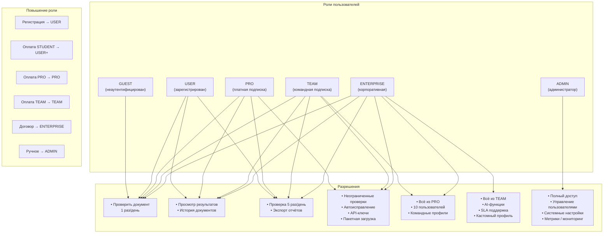

---

## 18. Диаграмма классов — Модели

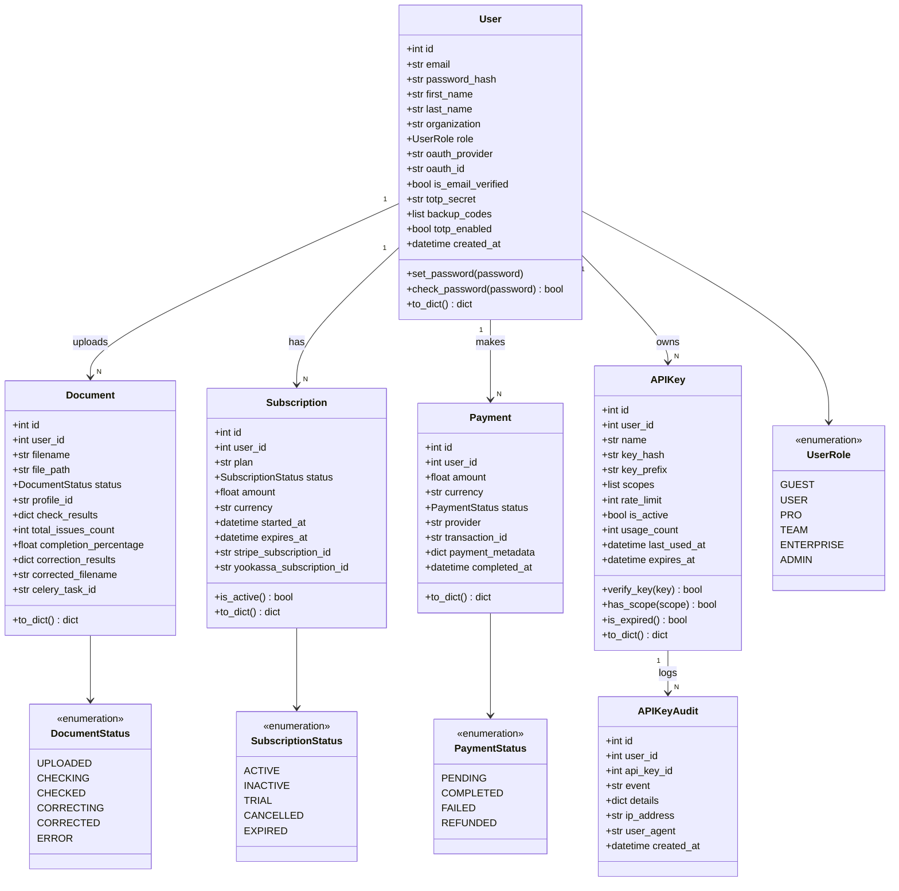

---

## 19. Диаграмма классов — Сервисы

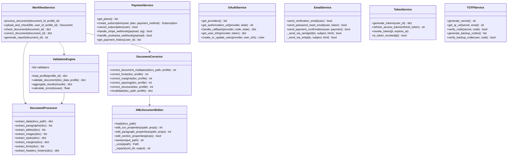

---

## 20. Диаграмма классов — Валидаторы

```mermaid
classDiagram
    class BaseValidator {
        <<abstract>>
        +str name
        +str category
        +validate(doc_data, profile) ValidationResult
        +_check_rule(value, expected, tolerance) Issue
    }

    class ValidationResult {
        +str validator_name
        +list~Issue~ issues
        +bool passed
        +dict metadata
    }

    class Issue {
        +str severity "ERROR|WARNING|INFO"
        +str location "paragraph N / table M"
        +str message
        +str rule
        +str suggestion
    }

    class StructureValidator {
        +validate_sections(doc_data) list
        +validate_toc(doc_data) list
        +validate_section_order(doc_data) list
    }

    class FontValidator {
        +expected_font str
        +expected_size int
        +validate_paragraph_fonts(paragraphs) list
        +validate_heading_fonts(headings) list
        +validate_code_fonts(code_blocks) list
    }

    class MarginValidator {
        +left_cm float
        +right_cm float
        +top_cm float
        +bottom_cm float
        +validate_margins(section_props) list
    }

    class ParagraphValidator {
        +line_spacing float
        +first_line_indent_cm float
        +validate_spacing(paragraphs) list
        +validate_indent(paragraphs) list
    }

    class BibliographyValidator {
        +validate_bibliography(doc_data) list
        +validate_references(doc_data) list
        +check_source_format(source) bool
    }

    class HeadingValidator {
        +validate_hierarchy(headings) list
        +validate_numbering(headings) list
        +validate_heading_format(heading) list
    }

    class TableValidator {
        +validate_table_structure(tables) list
        +validate_captions(tables) list
        +check_caption_format(caption) bool
    }

    class CrossReferenceValidator {
        +validate_figure_refs(doc_data) list
        +validate_table_refs(doc_data) list
        +validate_section_refs(doc_data) list
    }

    BaseValidator <|-- StructureValidator
    BaseValidator <|-- FontValidator
    BaseValidator <|-- MarginValidator
    BaseValidator <|-- ParagraphValidator
    BaseValidator <|-- BibliographyValidator
    BaseValidator <|-- HeadingValidator
    BaseValidator <|-- TableValidator
    BaseValidator <|-- CrossReferenceValidator
    BaseValidator <|-- FormulaValidator
    BaseValidator <|-- ImageValidator
    BaseValidator <|-- AppendixValidator
    BaseValidator <|-- AdvancedFormatValidator
    BaseValidator <|-- HeaderFooterValidator
    BaseValidator <|-- FootnoteValidator
    BaseValidator <|-- PageBreakValidator
    BaseValidator --> ValidationResult
    ValidationResult "1" --> "N" Issue
```

---

## 21. Диаграмма классов — Корректоры

```mermaid
classDiagram
    class BaseCorrector {
        <<abstract>>
        +str name
        +apply(doc, profile) CorrectionResult
        +can_fix(issue) bool
    }

    class CorrectionResult {
        +str corrector_name
        +int fixes_applied
        +list~str~ changes_log
        +list~str~ remaining_issues
    }

    class FontCorrector {
        +target_font str
        +target_size int
        +apply(doc, profile) CorrectionResult
        +fix_paragraph_font(para, font, size)
        +fix_heading_font(heading, profile)
    }

    class FormattingCorrector {
        +apply(doc, profile) CorrectionResult
        +fix_line_spacing(para, spacing)
        +fix_first_line_indent(para, indent_cm)
        +fix_paragraph_spacing(para)
    }

    class StructureCorrector {
        +apply(doc, profile) CorrectionResult
        +fix_section_numbering(doc)
        +fix_heading_levels(doc)
        +rebuild_toc(doc)
    }

    class StyleCorrector {
        +apply(doc, profile) CorrectionResult
        +fix_margins(doc, profile)
        +fix_page_size(doc)
        +fix_orientation(doc)
    }

    class ContentCorrector {
        +apply(doc, profile) CorrectionResult
        +fix_bibliography_numbering(doc)
        +fix_figure_captions(doc)
        +fix_table_captions(doc)
    }

    class DocumentCorrector {
        +list~BaseCorrector~ correctors
        +correct_document_multipass(path, profile) str
        +_run_pass(doc, corrector, profile) CorrectionResult
        +_revalidate(path, profile) dict
    }

    class XMLDocumentEditor {
        +docx_path str
        +load()
        +save(output) str
        +edit_run_properties(para_idx, run_idx, props)
        +edit_paragraph_properties(para_idx, props)
        +edit_section_properties(props)
        -xml_tree ElementTree
    }

    BaseCorrector <|-- FontCorrector
    BaseCorrector <|-- FormattingCorrector
    BaseCorrector <|-- StructureCorrector
    BaseCorrector <|-- StyleCorrector
    BaseCorrector <|-- ContentCorrector
    DocumentCorrector "1" --> "N" BaseCorrector
    DocumentCorrector --> XMLDocumentEditor
    BaseCorrector --> CorrectionResult
```

---

## 22. Sequence: Вход пользователя

```mermaid
sequenceDiagram
    actor User as Пользователь
    participant FE as Frontend (React)
    participant AC as AuthContext
    participant API as /api/auth
    participant DB as PostgreSQL
    participant Redis as Redis

    User->>FE: Заполнить email + пароль
    User->>FE: Нажать "Войти"
    FE->>AC: login(email, password)
    AC->>API: POST /api/auth/login
    API->>DB: SELECT * FROM users WHERE email=?
    DB-->>API: User record
    API->>API: werkzeug.check_password_hash()

    alt Неверный пароль
        API-->>AC: 401 {error: "Invalid credentials"}
        AC-->>FE: throw Error
        FE-->>User: "Неверный email или пароль"
    else 2FA включён
        API-->>AC: 200 {requires_2fa: true, temp_token}
        AC-->>FE: показать форму 2FA
        User->>FE: Ввести TOTP-код
        FE->>API: POST /api/auth/2fa/verify {code, temp_token}
        API->>API: pyotp.verify(code, secret)
        API->>API: Сгенерировать JWT
        API-->>AC: 200 {access_token, refresh_token, user}
    else Успешный вход
        API->>API: Сгенерировать JWT\n(access 1ч + refresh 30д)
        API-->>AC: 200 {access_token, refresh_token, user}
    end

    AC->>AC: localStorage.setItem(tokens, user)
    AC-->>FE: isAuthenticated = true
    FE-->>User: Редирект → Dashboard
```

---

## 23. Sequence: Загрузка и проверка документа

```mermaid
sequenceDiagram
    actor User as Пользователь
    participant FE as Frontend
    participant BE as Backend API
    participant Celery as Celery Worker
    participant WS as WebSocket
    participant DB as PostgreSQL

    User->>FE: Перетащить DOCX файл
    User->>FE: Выбрать профиль (ГОСТ/ВУЗ)
    User->>FE: Нажать "Проверить"
    FE->>BE: POST /api/document/upload\n{file, profile_id}\nAuthorization: Bearer <token>
    BE->>BE: Валидировать файл\n(расширение, размер ≤50MB)
    BE->>DB: INSERT INTO documents\n(status=UPLOADED, profile_id)
    BE->>Celery: task = process_document.delay(doc_id)
    BE->>DB: UPDATE documents SET celery_task_id=task.id
    BE-->>FE: 202 {document_id, status: "UPLOADED"}

    FE->>WS: connect()
    FE->>WS: subscribe(document_id)

    loop Обработка документа
        Celery->>WS: emit("progress_update", {doc_id, step, pct})
        WS-->>FE: progress_update event
        FE-->>User: Прогресс-бар обновляется
    end

    Celery->>DB: UPDATE documents\n(status=CHECKED,\ncheck_results=JSON)
    Celery->>WS: emit("task_complete", {doc_id})
    WS-->>FE: task_complete event
    FE->>BE: GET /api/validation/check?doc_id={id}
    BE->>DB: SELECT check_results
    DB-->>BE: {issues, score, completion_%}
    BE-->>FE: 200 {results}
    FE-->>User: Показать страницу результатов\n(CheckPage)
```

---

## 24. Sequence: Автоисправление документа

```mermaid
sequenceDiagram
    actor User as Пользователь
    participant FE as Frontend (CheckPage)
    participant BE as Backend API
    participant Corr as DocumentCorrector
    participant XML as XMLDocumentEditor
    participant DB as PostgreSQL
    participant FS as Файловая система

    User->>FE: Нажать "Автоисправить"
    FE->>BE: POST /api/document/correct\n{document_id}
    BE->>DB: SELECT document (status=CHECKED)
    BE->>DB: UPDATE status=CORRECTING
    BE->>Corr: correct_document_multipass(path, profile)

    loop Многопроходное исправление
        Corr->>XML: load(docx_path)
        Corr->>XML: edit_run_properties() [шрифты]
        Corr->>XML: edit_paragraph_properties() [отступы]
        Corr->>XML: edit_section_properties() [поля]
        Corr->>XML: save(temp_path)
        Corr->>Corr: revalidate(temp_path, profile)
        Corr-->>Corr: {remaining_issues}
    end

    Corr->>FS: Сохранить corrected_<id>.docx\napp/static/corrections/
    Corr-->>BE: {corrected_path, fixes_applied, changes_log}
    BE->>DB: UPDATE documents\nSET corrected_filename=...\nstatus=CORRECTED\ncorrection_results=JSON
    BE-->>FE: 200 {corrected_url, fixes_applied}
    FE-->>User: "Исправлено N ошибок!"
    FE-->>User: Кнопка "Скачать исправленный файл"

    opt Генерация отчёта
        User->>FE: Нажать "Скачать отчёт"
        FE->>BE: POST /api/document/generate-report
        BE->>BE: Сформировать DOCX-отчёт\n(docxtpl)
        BE->>FS: Сохранить report_<id>.docx
        BE-->>FE: {report_url}
        FE-->>User: Скачать report_<id>.docx
    end
```

---

## 25. Sequence: Refresh JWT-токена

```mermaid
sequenceDiagram
    participant FE as Frontend (axios interceptor)
    participant BE as Backend API
    participant Redis as Redis (blacklist)
    participant DB as PostgreSQL

    FE->>BE: GET /api/auth/me\nAuthorization: Bearer <expired_access_token>
    BE->>Redis: Проверить JTI в blacklist
    BE->>BE: Декодировать JWT → TokenExpiredError
    BE-->>FE: 401 {error: "Token expired"}

    FE->>FE: Перехватчик Axios (interceptor)\nОбнаружить 401

    FE->>BE: POST /api/auth/refresh\n{refresh_token}
    BE->>BE: Декодировать refresh_token
    BE->>Redis: Проверить refresh JTI в blacklist
    alt Refresh token истёк или в blacklist
        BE-->>FE: 401 {error: "Refresh token expired"}
        FE->>FE: AuthContext.logout()
        FE-->>FE: Редирект → /login
    else OK
        BE->>DB: SELECT user WHERE id=sub
        BE->>BE: Сгенерировать новый access_token
        BE-->>FE: 200 {access_token}
        FE->>FE: Обновить localStorage.auth.token
        FE->>BE: Повторить оригинальный запрос\nс новым токеном
        BE-->>FE: 200 {данные}
    end
```

---

## 26. Структура профилей валидации

```mermaid
graph TB
    subgraph PROFILES["Профили (backend/profiles/)"]
        SYS1["bgpu_2023.json\n(БГПУ, системный)"]
        SYS2["default_gost.json\n(ГОСТ 7.32-2017)"]
        SYS3["gost_r_7_0_100_2018.json\n(ГОСТ для библиографии)"]
        CUSTOM["custom_*.json\n(пользовательские)"]
    end

    subgraph STRUCTURE["Структура профиля"]
        ROOT["Profile JSON"]
        ROOT --> META["Метаданные\n• id\n• name\n• category\n• is_system\n• version\n• description"]
        ROOT --> RULES["rules: {...}"]
        RULES --> FONT["font:\n• name: Times New Roman\n• size: 14\n• code_size: 12"]
        RULES --> MARGINS["margins:\n• left: 3.0 cm\n• right: 1.0 cm\n• top: 2.0 cm\n• bottom: 2.0 cm"]
        RULES --> SPACING["spacing:\n• line_spacing: 1.5\n• first_line_indent: 1.25\n• before: 0\n• after: 0"]
        RULES --> HEADINGS["headings:\n• numbering: true\n• bold: true\n• uppercase: varies"]
        RULES --> BIBLIO["bibliography:\n• format: GOST\n• numbering: true"]
        RULES --> PAGES["pages:\n• size: A4\n• orientation: portrait\n• page_numbers: true"]
    end

    subgraph API_FLOW["API управления профилями"]
        GET_LIST["GET /api/profiles\n→ все профили (system + user)"]
        GET_ONE["GET /api/profiles/<id>\n→ один профиль"]
        POST["POST /api/profiles\n{name, rules}\n→ создать пользовательский"]
        PATCH["PATCH /api/profiles/<id>\n{rules}\n→ обновить (только свои)"]
        DELETE["DELETE /api/profiles/<id>\n→ удалить (только свои)"]
    end

    SYS1 & SYS2 & SYS3 & CUSTOM --> STRUCTURE
    STRUCTURE --> API_FLOW
```

---

## 27. Дерево маршрутов фронтенда

```mermaid
graph TD
    ROOT["/"] --> HOME["HomePageLinear\n(Landing Page)"]

    ROOT --> AUTH["/login\nLoginPage\n(email + OAuth)"]
    ROOT --> OAUTH["/auth/:provider/callback\nOAuthCallbackPage"]

    ROOT --> PROTECTED["Защищённые маршруты\n(требуют JWT)"]

    PROTECTED --> DASH["/dashboard\nDashboardPage"]
    PROTECTED --> UPLOAD["/upload\nUploadPage"]
    PROTECTED --> CHECK["/check/:documentId\nCheckPage"]
    PROTECTED --> REPORT["/report/:documentId\nReportPage"]
    PROTECTED --> HISTORY["/history\nHistoryPage"]
    PROTECTED --> PREVIEW["/preview/:documentId\nPreviewPage"]

    PROTECTED --> PROFILES["/profiles\nProfilesPage"]
    PROFILES --> PROF_NEW["/profiles/new\nProfileEditor (create)"]
    PROFILES --> PROF_EDIT["/profiles/:id/edit\nProfileEditor (edit)"]
    PROFILES --> PROF_CMP["/profiles/compare\nProfileComparison"]

    PROTECTED --> ACCOUNT["/account\nAccountPage\n(профиль, 2FA, пароль)"]
    PROTECTED --> SETTINGS["/settings\nSettingsPage"]
    PROTECTED --> BILLING["/billing\nBillingPage\n(подписка, платежи)"]

    PROTECTED --> KEYS["/api-keys\nAPIKeysPage"]

    PROTECTED --> ADMIN["/admin\nAdminPage\n(только ADMIN)"]

    subgraph LAYOUTS["Layouts"]
        L_AUTH["AuthShell\n(форма входа)"]
        L_APP["AppLayout\n(sidebar + header)"]
        L_NONE["Без layout\n(landing, preview)"]
    end

    AUTH --> L_AUTH
    DASH & UPLOAD & CHECK --> L_APP
    HOME --> L_NONE
```

---

## 28. Обзорная диаграмма безопасности

```mermaid
graph TB
    subgraph PERIMETER["Периметр безопасности"]
        NGINX["Nginx\n• TLS termination\n• Rate limiting (IP)\n• Security headers"]
    end

    subgraph AUTH_LAYER["Слой аутентификации"]
        JWT["JWT Access Tokens\n• Expiry: 1ч\n• HS256 подпись\n• JTI в blacklist (Redis)"]
        REFRESH["JWT Refresh Tokens\n• Expiry: 30д\n• Ротация при обновлении"]
        APIKEY["API Key Auth\n• SHA-256 хэш в БД\n• Только префикс хранится\n• Scope-based access"]
        OAUTH2["OAuth2\n• Google / GitHub / Yandex\n• PKCE flow\n• State parameter (CSRF)"]
        TOTP["2FA TOTP\n• RFC 6238\n• 10 backup codes\n• Disable требует пароль"]
    end

    subgraph DATA["Защита данных"]
        PASS["Пароли\n• PBKDF2-SHA256\n• werkzeug.security"]
        EMAIL["Email верификация\n• Токен в Redis (TTL 24ч)\n• Одноразовый"]
        RESET["Password Reset\n• Токен в Redis (TTL 1ч)\n• Одноразовый"]
    end

    subgraph RATE["Rate Limiting"]
        RL_GLOBAL["Глобальный: 100 req/мин"]
        RL_LOGIN["Login: 20 попыток/ч"]
        RL_UPLOAD["Upload: 10 файлов/ч (free)"]
        RL_API["API Keys: индивидуальный"]
    end

    subgraph VALIDATION["Валидация входных данных"]
        FV["Файлы: только .docx, ≤50MB"]
        EV["Email: email-validator"]
        PV["Пароли: мин 8 символов"]
        TV["Токены: JWT + signature verify"]
    end

    subgraph DB_SEC["Безопасность БД"]
        ORM["SQLAlchemy ORM\n(параметрические запросы)"]
        NO_SQL["Нет сырых SQL-запросов"]
        ENUM["Enum типы для ролей и статусов"]
    end

    subgraph PAYMENT_SEC["Безопасность платежей"]
        STRIPE_SIG["Stripe webhook signature\nSTRIPE_WEBHOOK_SECRET"]
        NO_CARD["Карточные данные не хранятся\n(только Stripe token)"]
    end

    NGINX --> JWT & APIKEY
    JWT --> AUTH_LAYER
    OAUTH2 --> AUTH_LAYER
    TOTP --> AUTH_LAYER
    AUTH_LAYER --> RATE
    RATE --> VALIDATION
    VALIDATION --> DB_SEC
    DATA --> AUTH_LAYER
```

---

## Примечания по рендерингу

Все диаграммы используют **Mermaid** синтаксис. Для просмотра:

| Инструмент | Как использовать |
|------------|-----------------|
| **GitHub** | Откройте этот файл в браузере — диаграммы отрендерятся автоматически |
| **VS Code** | Установите плагин "Mermaid Preview" или "Markdown Preview Mermaid Support" |
| **Obsidian** | Поддерживается из коробки |
| **draw.io** | Импорт через Extras → Edit Diagram |
| **mermaid.live** | Вставить код отдельной диаграммы на сайт |
| **Notion** | Блок "Code" с языком "mermaid" |
