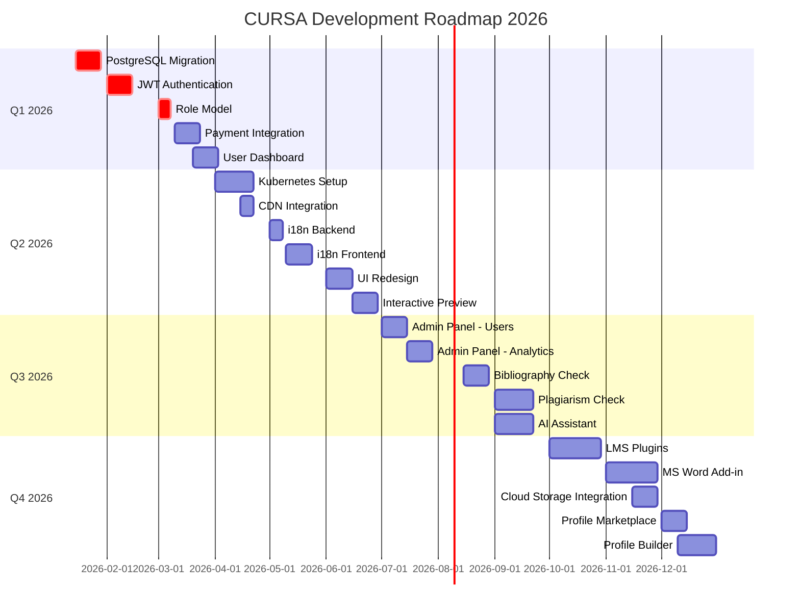
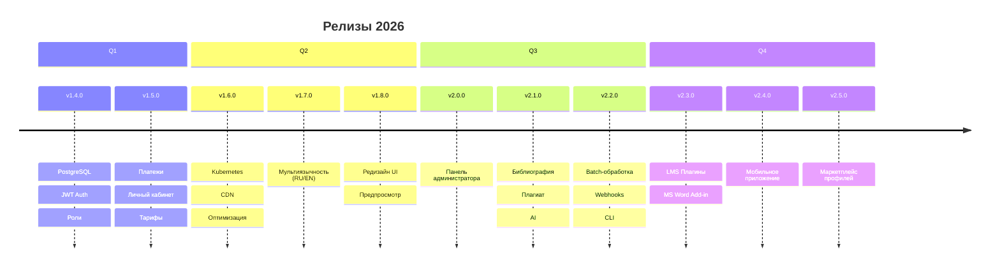
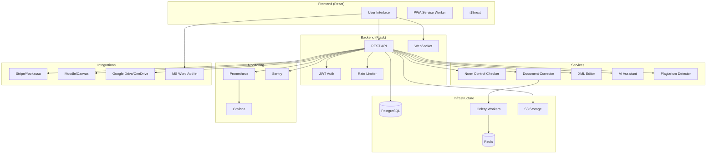
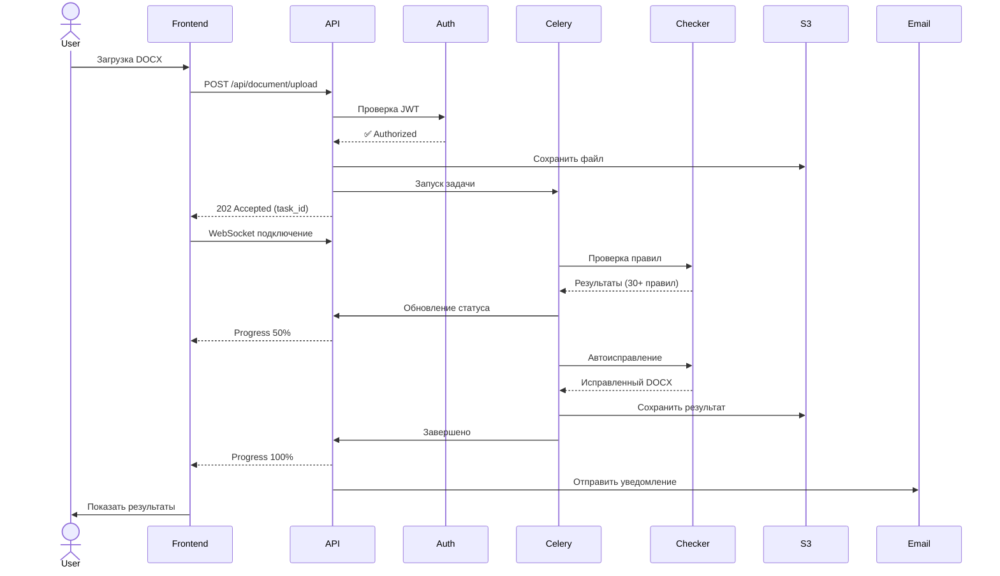
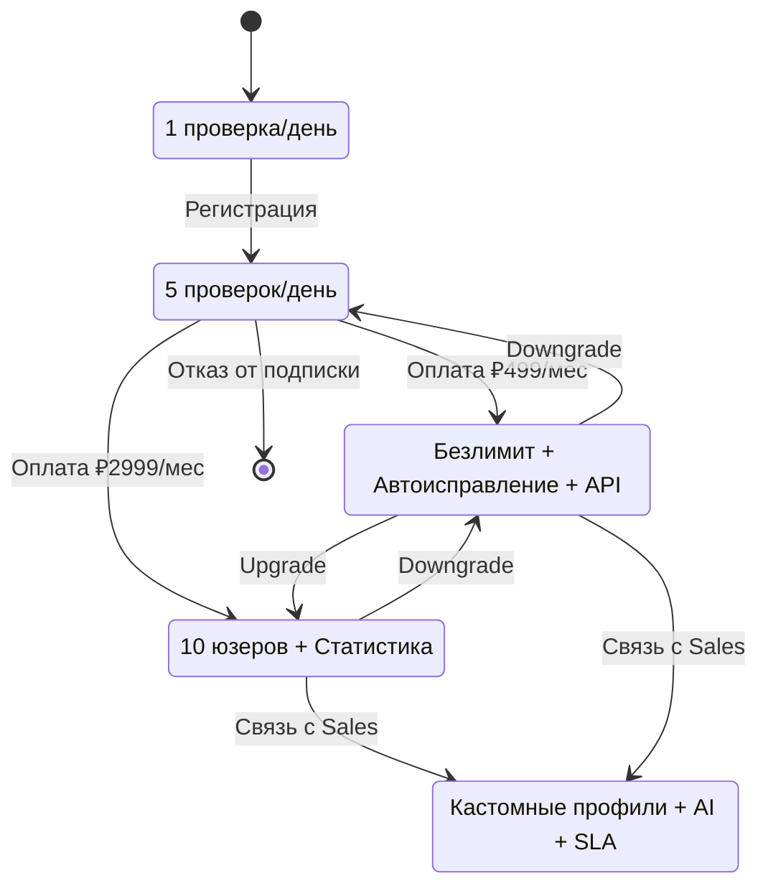
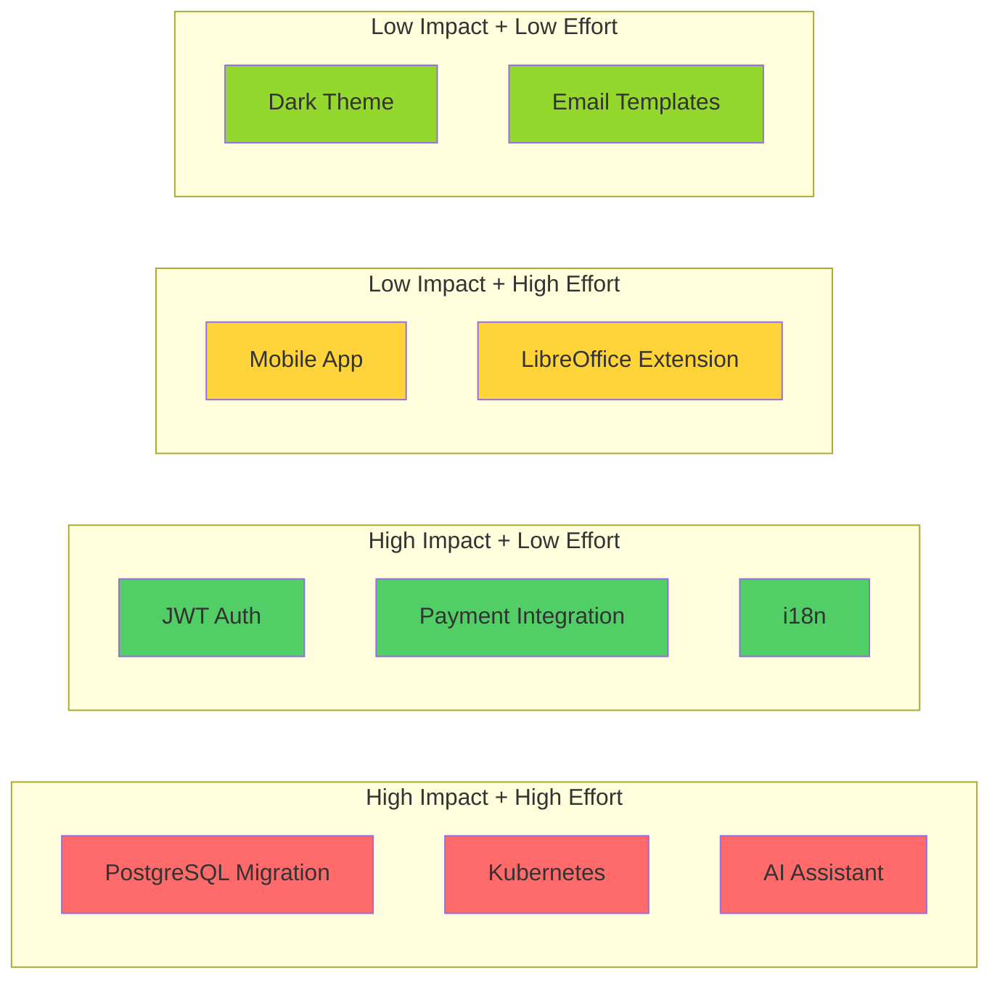
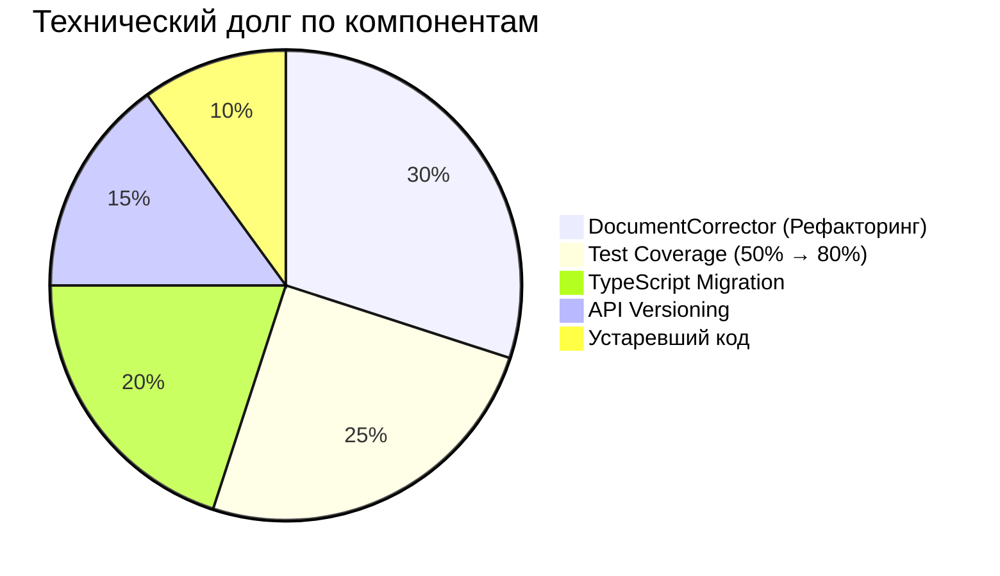
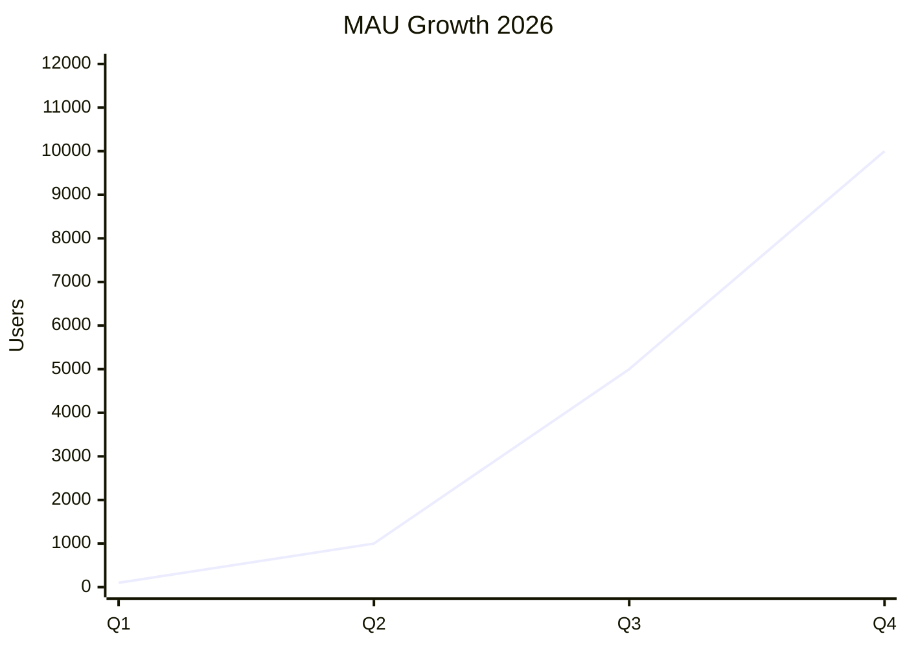

# 📊 Визуальный Roadmap CURSA 2026

## Gantt-диаграмма основных вех

## Timeline по версиям

## Архитектура компонентов

## User Flow (проверка документа)

## Monetization Flow

## Priority Matrix

## Технический долг Tracking

## Метрики роста (прогноз)

---

**Примечание:** Все диаграммы можно рендерить в GitHub, GitLab, VS Code (с расширением Markdown Preview) или на [mermaid.live](https://mermaid.live).

**Легенда приоритетов:**
- 🔴 Критический (crit)
- 🟢 Низкий приоритет
- 🟡 Можно отложить

---

**Версия:** 1.0  
**Дата:** 02.02.2026
